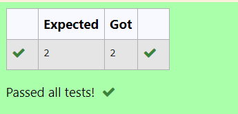

# RANK-OF-A-MATRIX
## Aim:
To write a python program to find the rank of a matrix
## Equipment’s required:
1. 	Hardware – PCs
2. 	Anaconda – Python 3.7 Installation / Moodle-Code Runner
## Algorithm:
## Step 1: Select the library as numpy to evaluate linalg
## Step 2: Enter the given matrix matrix
## Step 3: Using the np.linalg.matrix_rank(), we can find the rank of the given matrix.
## Step 4: Print the variable that stores the rank(value) of the given matrix
## Program:
```python
#Program to find the rank of a matrix.
#Developed by: H.berjin shabeck
#RegisterNumber:22007550
import numpy as np
A=np.array([[3,2,5],[1,1,2],[3,3,6]])
sol=np.linalg.matrix_rank(A)
print(sol)
```
## Output:

## Result:
Thus the rank for the given matrix is successfully solved by  using a python program.

